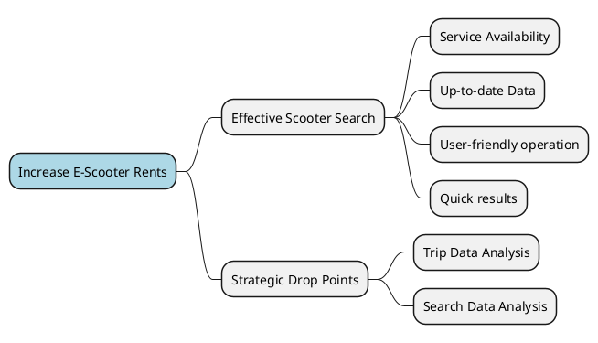
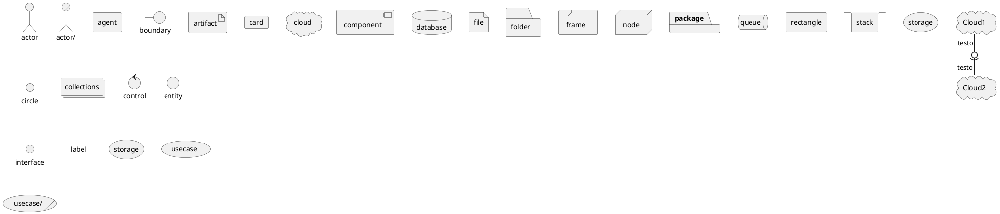

# Domain Analysis

## Impact Mapping


## Subdomain & Context Analysis

### E-Scooter Subdomain
*Core Subdomain*
#### Scooter Monitor Context
One of the core contexts. Responsible for keeping track of scooter positions, battery level and other useful data for ma#ny business use cases.
#### Scooter State Context
Responsible for defining control policies to be applied to e-scooters according to domain/business policies.
#### Scooter Physical Control Context
Responsible for all physical actuation of logic control policies.
#### Scooter Data Context
Storage of e-scooters technical and logical static information, like ID, serial number, dimensions, weight...
#### Scooter Search Context
Uses data from the Scooter Monitor Context to provide the search functionality to customers (that are looking for available scooters to ride).

### Trip Subdomain
*Core Subdomain*
#### Area of Service Context
Keeps track of service areas, scooter-area bindings and scooter position in order to detect escapes.
#### Rent Context
Handles the process of scooter renting from the beginning to its end.
#### Trip Context
Data collection about trips done by all customers.

### Insight Subdomain
*Core Subdomain*
#### Drop points Planning Context
Exploits usage data from other contexts to compute drop point locations or suggestions.

### Payment Subdomain
*Supporting Subdomain*
#### Payment Context
Manages all customer in-app transactions, virtual currency, and triggers real-world transactions.

### User Subdomain
*Generic Subdomain*
#### Customer Context
Keeps track of customers anagraphic data.
#### Auth Context
Manages login data and role based authorization for all agents, including employees and customers.


## Context Map
```
TODO
```
