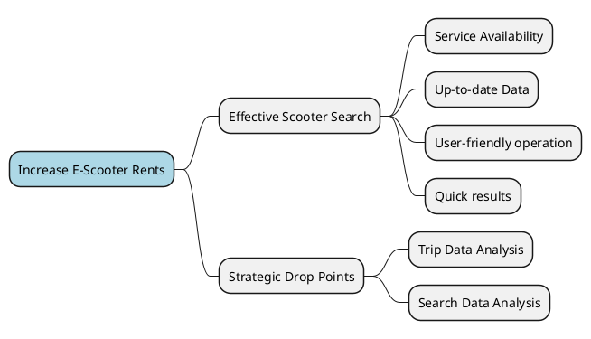
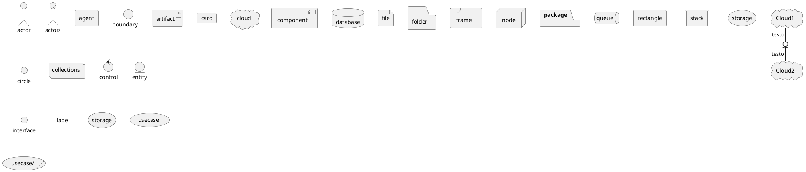

# Domain Analysis

## Impact Mapping


## Subdomain & Context Analysis

### E-Scooter Subdomain
*Core Subdomain*
#### Scooter Monitor Context
One of the core contexts. Responsible for keeping track of scooter positions, battery level and other useful data for many business use cases.
#### Scooter Logic Context
Responsible for defining control policies and applying policies to e-scooters according to other contexts. It's considered the ground truth for scooter's logic data like unlocked/locked state.
#### Scooter Physical Control Context
Responsible for all physical actuation of logic control policies.
#### Scooter Data Context
Storage of e-scooters technical and logical static information, like ID, serial number, dimensions, weight...
#### Scooter Search Context
Uses data from the Scooter Monitor Context to provide the search functionality to customers (that are looking for available scooters to ride). ALso responsible for the searchability policies.

### Trip Subdomain
*Core Subdomain*
#### Area of Service Context
Keeps track of service areas, scooter-area bindings and scooter position in order to detect escapes.
#### Rent Context
Handles the process of scooter renting from the beginning to its end. Also responsible for the rent business policies.
#### Trip Context
Data collection about trips done by all customers.

### Insight Subdomain
*Core Subdomain*
#### Drop points Planning Context
Exploits usage data from other contexts to compute drop point locations or suggestions.

### Payment Subdomain
*Supporting Subdomain*
#### Payment Context
Manages all customer in-app transactions, virtual currency, and triggers real-world transactions.

### User Subdomain
*Generic Subdomain*
#### Customer Context
Keeps track of customers anagraphic data.
#### Authorization Context
Manages login data and role based authorization for all agents, including employees and customers.


## Context Map
```plantuml
@startuml
!include Metamodel/ContextMap.metamodel.iuml
$subdomain "E-Scooter Subdomain" {
    $context "Scooter Monitor Context" as monitor
    $context "Scooter Logic Context" as logic
    $context "Scooter Physical Control Context" as control
    $context "Scooter Data Context" as data
    $context "Scooter Search Context" as search

    $customer_supplier(control, logic)
    $conformist(search, monitor)
    $conformist(logic, monitor)
    $conformist(search, logic)
    $shared_kernel(monitor, control, Azure Digital-Twins)
}

$subdomain "Trip Subdomain" {
    $context "Area of Service Context" as area
    $context "Rent Context" as rent
    $context "Trip Context" as trip

    $conformist(trip, rent)
    $conformist(rent, area)
}

$conformist(area, monitor)
$conformist(trip, monitor)
$customer_supplier(logic, rent)
$conformist(rent, logic)
$

$subdomain "Insight Subdomain" {
    $context "Drop Points Planning Context" as planning
}

$subdomain "Payment Subdomain" {
    $context "Payment Context" as payment
}

$subdomain "User Subdomain" {
    $context "Customer Context" as customer
    $context "Authorization Context" as auth
}

@enduml
```
