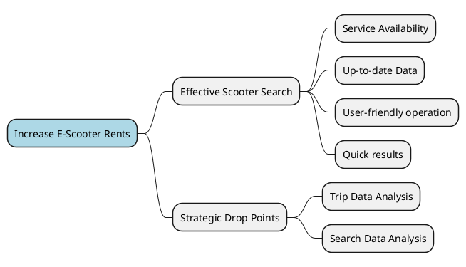
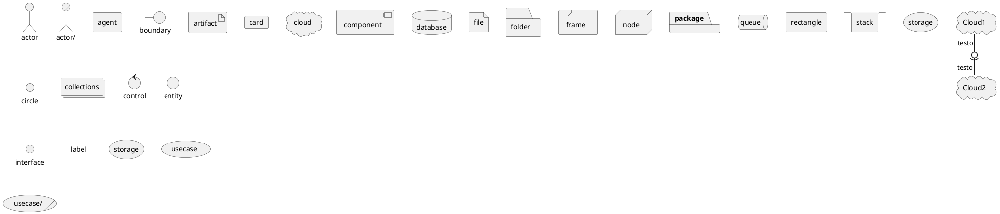

# Domain Analysis

## Impact Mapping


## Subdomain & Context Analysis

### E-Scooter Subdomain
*Core Subdomain*
#### Scooter Monitor Context
One of the core contexts. Responsible for keeping track of scooter positions, battery level and other useful data coming from the physical devices. 
#### Scooter State Context
Responsible for keeping track of the scooter logic state, meaning managing the properties of being locked/unlocked and enabled/disabled. Provides all the operations on the scooter state to other contexts and it's considered the ground truth on this data.
#### Scooter Policy Context
Responsible for defining control policies and apply them operating on the State Context, like power save, max speed, that depend only on the scooter physical state.
#### Scooter Physical Control Context
Responsible for physical actuation of all the remote operations on the scooter.
#### Area of Service Context
Keeps track of service areas, scooter-area bindings and scooter position in order to detect escapes.
#### Scooter Data Context
Storage of e-scooters technical and logical static information, like ID, serial number, dimensions, weight...

### Trip Subdomain
*Core Subdomain*
#### Renting Context
Manages the renting operations including storing data on which scooters are rented and by whom. Provides the interface for searching and renting scooters and communicates with the State Context in order to update the state when needed.
#### Trip Context
Data collection about trips done by all customers such as starting points, duration, kilometers.

### Insight Subdomain
*Core Subdomain*
#### Drop points Planning Context
Exploits usage data from other contexts to compute drop point locations or suggestions.
Stores data about user search requests coming to the Rent Context.

### Payment Subdomain
*Supporting Subdomain*
#### Payment Context
Manages all customer in-app transactions, virtual currency, and triggers real-world transactions.

### User Subdomain
*Generic Subdomain*
#### Customer Context
Keeps track of customers anagraphic data.
#### Authorization Context
Manages login data and role based authorization for all agents, including employees and customers.


## Context Map
```plantuml
@startuml
!include Metamodel/ContextMap.metamodel.iuml
$subdomain "E-Scooter Subdomain" {
    $context "Scooter Monitor Context" as monitor
    $context "Scooter Policy Context" as policy
    $context "Scooter State Context" as state
    $context "Scooter Physical Control Context" as control
    $context "Scooter Data Context" as data
    $context "Area of Service Context" as area

    $common_interface(data, Scooter Lifecycle, lifecycle)
    $conformist(state, lifecycle, $interface=true)
    $conformist(monitor, lifecycle, $interface=true)
    $conformist(control, lifecycle, $interface=true)
    $conformist(policy, lifecycle, $interface=true)
    $conformist(area, lifecycle, $interface=true)

    $common_interface(monitor, Scooter Positions, positions)
    $conformist(area, positions, $interface=true)

    $customer_supplier(control, state)
    $shared_kernel(monitor, control, Azure Digital-Twins)
    $conformist(policy, monitor)
    $customer_supplier(state, policy)
}

$subdomain "Trip Subdomain" {
    $context "Rent Context" as rent
    $context "Trip Context" as trip
    
    $conformist(trip, rent)
}

$conformist(rent, lifecycle, $interface=true)
$bidirectional_customer_supplier(state, rent)

$customer_supplier(state, area)
$conformist(rent, positions, $interface=true)
$conformist(trip, positions, $interface=true)

$subdomain "Insight Subdomain" {
    $context "Drop Points Planning Context" as planning
}

$conformist(planning, trip)
$conformist(planning, rent)

$subdomain "Payment Subdomain" {
    $context "Payment Context" as payment
}

$conformist(payment, trip)
$conformist(payment, rent)

$subdomain "User Subdomain" {
    $context "Customer Context" as customer
    $context "Authorization Context" as auth
    $customer_supplier(auth, customer)
}

$conformist(payment, customer)


@enduml
```
