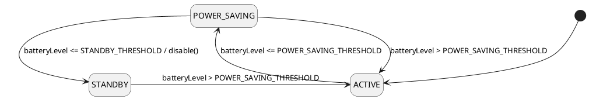

# Scooter Control Domain Model

## Class Diagram
```plantuml
@startuml
!include Metamodel/Domain.Entities.metamodel.iuml
$entity "Scooter" as scooter {
  + id : EntityId
  + locked : Boolean
  + disabled : Boolean
  + powerMode : PowerMode
  + maxSpeed : Speed

  + lock()
  + unlock()
  + enable()
  + disable()
  + setMaxSpeed(speed : Speed)
  + setPowerMode(mode : PowerMode)
}


$service("PowerModeManager") {
  + onBatteryLevelChanged(batteryLevel : BatteryLevel)
}

$factory("ScooterFactory", scooter_factory) {
  + createScooter(id : EntityId) : Scooter
}

scooter_factory ..> scooter
@enduml
```

## Details

### PowerMode
```plantuml
@startuml
!include Metamodel/Domain.Entities.metamodel.iuml
$enum "PowerMode" {
  ACTIVE
  POWER_SAVING
  STANDBY
}
@enduml
``` 
Represents all the possible power-related modes a scooter can have.

### BatteryLevel
```plantuml
@startuml
!include Metamodel/Domain.Entities.metamodel.iuml
$value "BatteryLevel" {
  + percentage : Percentage
}
@enduml
```
_percentage_ represents a Percentage of the level of the battery.

## Behaviours

## Domain Services

### Power Mode Manager
The Power Mode State Diagram:
