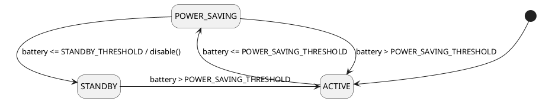

# Scooter Control Domain Model

## Class Diagram
```plantuml
@startuml
!include Metamodel/Domain.Entities.metamodel.iuml
$entity "Scooter" {
  + locked : Boolean
  + disabled : Boolean
  + powerMode : PowerMode
  + maxSpeed : Speed

  + lock()
  + unlock()
  + enable()
  + disable()
  + setMaxSpeed(speed : Speed)
  + setPowerMode(mode : PowerMode)
}

$value "Speed" {
  + metersPerSecond : Real
  + kilometersPerHour : Real
}

$enum "PowerMode" {
  ACTIVE
  POWER_SAVING
  STANDBY
}
@enduml
```

## Details

### Speed
_metersPerSecond_ and _kilometersPerHour_ are two different units for the same speed value.
**Constraints**:

- $metersPerSecond = kilometersPerHour / 3.6$
- $metersPerSecond >= 0$

### PowerMode
Represents all the possible power-related modes a scooter can have.
## Behaviours


## Domain Services

### Power Mode Manager
The Power Mode State Diagram:
