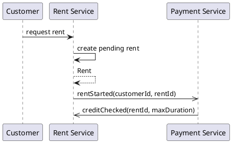

# Payment Domain Model

## Class Diagram
```plantuml
@startuml
!include Metamodel/Domain.Entities.metamodel.iuml

$aggregate("Rent") {
    $aggregate_root("Rent") {
        + id: EntityId
        + start: Timestamp
        + rider: EntityId
        + stopped: Boolean
    }

    $entity("Transaction") {
        + id: EntityId
        + time: Timestamp
    }
}

' $aggregate("Customer") {

'     $aggregate_root("Customer", customer) {
'         + id: EntityId
'         + balance: Credit
'         + locked: Boolean
'         + transactions: Set[Transaction]

'         + addCredit(credit: Credit)
'         + pay(credit: Credit): Result[Credit]
'     }

'     $value("Credit", credit) {
'         + amount: Integer
'         + inDollars: Real
'         + inEuros: Real
'     }

'     customer o- credit

'     $entity("Transaction", transaction) {
        
'     }
' }

' $factory("CreditFactory", credit_factory) {
'     + fromAmount(amount: Integer) : Credit
'     + fromEuros(euros: Real): Credit
'     + fromDollars(dollars: Real): Credit
' }

' $service("CreditVerifier", verifier) {
'     + checkIfCustomerCanUnlock(customer: Customer): Result[Nothing]
'     + checkBalanceForRent(customer: Customer): Result[RentCheckResult]
' }

' $value("RentCheckResult") {
'     + duration: Duration
' }

' $service("PaymentManager", payment_manager) {
'     + pay(credit: Credit, customer: Customer): Result[Payment]
' }

' $service("PaymentPolicy", payment_policy) {
'     + computeTripFee(trip: Trip)
' }

' credit_factory ..> credit

@enduml
```

## Details


### Rent Process Diagram
