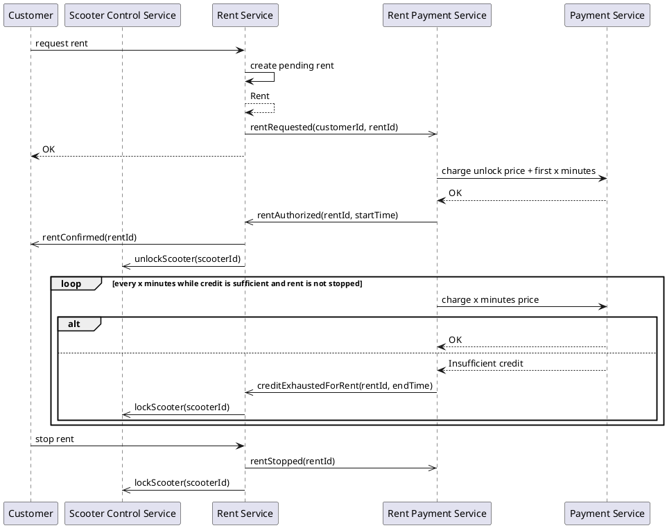

# Rent Payment Domain Model

## Class Diagram
```plantuml
@startuml
!include metamodel/domain.entities.metamodel.iuml

$aggregate("Rent") {
  $aggregate_root("Rent", rent) {
    + id: EntityId
    + start: Timestamp
    + lastPaymentTime: Timestamp
    + rider: EntityId
    + stopped: Boolean
  }
}

$value("Currency", currency) {
  + amount: Integer
}

$service("RentPaymentManager", rentpay) {
  + onRentStarted(rentId: EntityId, rider: EntityId): Result[Rent]
  + onRentStopped(rent: Rent): Result[Nothing]
  + onNextPayment(rent: Rent): Result[Nothing]
}

rentpay ..> currency
rentpay .> rent

@enduml
```

## Details


### Rent Process Diagram


## Domain Events

- **RentAuthorized**: 
- **RentNotAuthorized**: 
- **CreditExhaustedForRent**: 
 