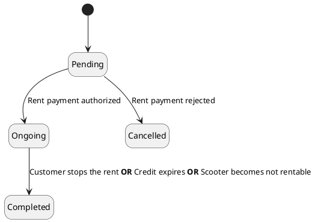
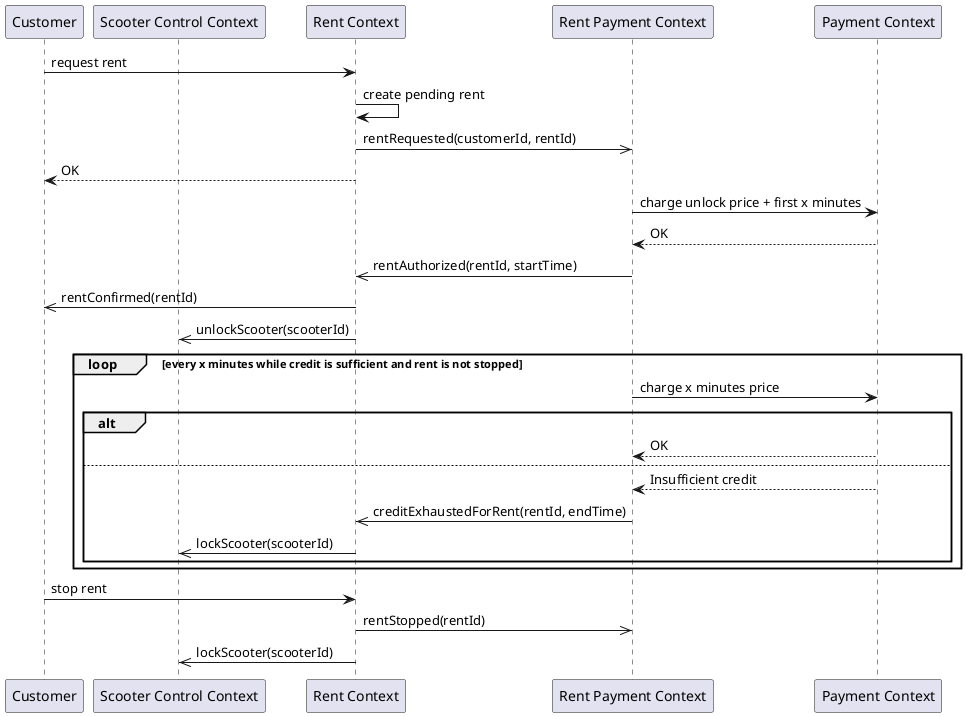

# Rent Domain Model

## Class Diagram
```plantuml
@startuml
!include metamodel/domain.entities.metamodel.iuml
$aggregate("Scooter") {
  $aggregate_root("Scooter", scooter) {
    + id: EntityId
    + ongoingRentId: Option[EntityId]
    + isInStandby: Boolean
    + isOutOfService: Boolean
    + isEnabled: Boolean

    + rent(rentId: EntityId): Result[Nothing]
    + clearRent()
    + enable()
    + disable()
    + enterStandby()
    + leaveStandby()
    + enterAreaOfService()
    + leaveAreaOfService()
    + isRentable(): Boolean
    + isAvailable(): Boolean
  }
}

$aggregate("Rent") {
  $aggregate_root("Rent", rent) {
    + id: EntityId
    + scooterId: EntityId
    + customerId: EntityId
    + requestTimestamp: Timestamp
    + confirmationInfo: Option[RentConfirmationInfo]
    + cancellationInfo: Option[RentCancellationInfo]
    + stopInfo: Option[RentStopInfo]

    + confirm(confirmationInfo: ConfirationInfo): Result[Nothing]
    + cancel(cancellationInfo: CancellationInfo): Result[Nothing]
    + stop(stopInfo: StopInfo): Result[Nothing]
    + getState(): RentState
  }

  $value("RentConfirmationInfo", confirmationInfo) {
    + date: Timestamp
  }

  $value("RentCancellationInfo", cancellationInfo) {
    + reason: RentCancellationReason
  }

  $value("RentStopInfo", stopInfo) {
    + reason: RentStopReason
    + date: Timestamp
  }

  $enum("RentCancellationReason", cancellationReason) {
    CREDIT_INSUFFICIENT
    SCOOTER_UNAVAILABLE
    INTERNAL_ERROR
  }

  $enum("RentStopReason", stopReason) {
    STOPPED_BY_CUSTOMER
    OUT_OF_AREA
    CREDIT_EXHAUSTED
    STANDBY
    DISABLED
    NOT_RENTABLE
  }

  $enum("RentState", rentState) {
    PENDING
    ONGOING
    CANCELLED
    COMPLETED
  }

  rent "1" -- "0..1" confirmationInfo
  rent "1" -- "0..1" cancellationInfo
  rent "1" -- "0..1" stopInfo
  rent "*" - "1" rentState
  stopInfo "*" -- "1" stopReason
  cancellationInfo "*" -- "1" cancellationReason
}

$aggregate("Customer") {
  $aggregate_root("Customer", customer) {
    + id: EntityId
    + ongoingRentId: Option[EntityId]

    + startRent(rentId: EntityId): Result[Nothing]
    + endRent(): Result[Nothing]
  }
}

rent "0..1" <..> "1" scooter
rent "0..1" <..> "1" customer

@enduml
```

## Rules

A scooter has three properties that decide if customers have the ability to rent it.

- _enabled_: a scooter disabled by an employee cannot be rented;
- _standby_: a scooter in standby mode cannot be rented;
- _outOfService_: a scooter outside of its area of service cannot be rented.

While this context has the authority over the enabled property, the remaining are owned by different contexts which _Rent_ has to integrate with.

The combination of the aforementioned properties defines the _rentability_ of a scooter for what concerns the _rent context_. In addition, a scooter cannot be rented by any customer if another customer is already riding it. This defines its _availability_ state. In order to succeed, a _rent request_ must be made on a scooter that is both rentable and available at the time of the request.

Finally, a constraint exists to prevent customers from renting scooter while another rent is ongoing for them.

## Rent lifecycle diagram



## Rent Process Diagram


## Domain Events

### Rent aggregate
- **RentRequested**: When a customer requests a rent.
- **RentConfirmed**: When a rent is confirmed.
- **RentStopped**: When a rent is stopped.
- **RentCancelled**: When a rent is cancelled.
- **RentEnded**: When a rent is ended either by cancellation or by stop.

### Scooter aggregate
- **ScooterEnabled**: When a scooter is enabled.
- **ScooterDisabled**: When a scooter is disabled.
- **ScooterBecameRentable**: When the combination of enabled/out of service/standby is changed to make the scooter rentable.
- **ScooterBecameNotRentable**: When the combination of enabled/out of service/standby is changed to make the scooter not rentable.
