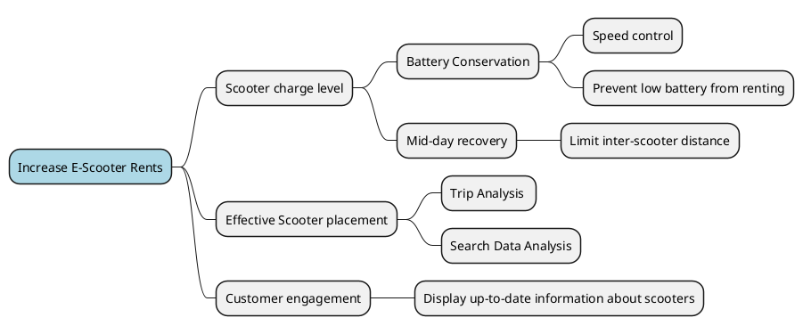

# Business Problem Analysis
In order to kick-off the knowledge crunching process, the first discussion with the stakeholders is focused on the identification of the business needs. The objective is to derive how it might be possible to create a software system that could maximise the company business gain/value.

While doing so the analysts start developing the [Ubiquitous Language](ubiquitous-language.md) in parallel, to write down the definition of the domain terminology given that they have a clear understanding of the vocabulary in the domain space.

## Stakeholders Interview

_What is the problem that you're trying to solve by adopting a new software solution?_
>We would like to increase the average number of E-scooter rents in a day.

_What are the possible factors that influence that?_
>Electric scooters have batteries that run out during the day, we often are not able to recharge them until night so we progressively lose available scooters as the day goes on.

_Do you think there is a way to save some battery during the day to make the scooter last longer?_
>Speed is the main factor that drain the scooter battery. If you want to go fast the motor consumes more energy, maybe speed control might be a thing to look into. Also it's very important that scooters with a low level of battery don't turn off because we can lose the tracking.

_About that, should the users be prevented from picking up very low battery scooters?_
>Yes we would like that so we don't encounter problems. Also we would like to be very upfront with our customers about the information about the scooter when they need to choose one: if you need to do a long trip the worst thing that can happen is to have your scooter stop at some point and need to find another one.

_Why is it hard to recover and recharge a scooter?_
>We scatter scooters around the city and then let people wander and drop them off wherever they like, sometimes they can be pretty far away from each other and make the recovering process tedious and costly to do during the day.

_If it was easier do you think you would be able to recharge some drained scooter and put them back as available?_
>Yes it should be doable, the scooters take about 3 hours to recharge and then they are ready to go again.

_What else do you think can improve the number of rents?_
>We noticed that not all scooters are used in the same way. In some areas they are quickly depleted whilst in some others they stay basically fully charged and sometime we recover them in the same spot where we dropped them. Also the same scooter can travel a long distance either by a lot of short trips or very long ones depending on the area but we have little data on that. 

_How do you choose where to place your scooters?_
>Right now we're going by trial and error basically, and then we try to note down which places are the best. If one day we see that all the scooters in a spot have been used we try to put some more in the next one. Our objective is that if you need a scooter you should never have to walk too much to find one.

## Impact Mapping
The result of the interview is summed up into an impact map, identifying the root problem and different possible features of interest that raised from the discussion. Theese can be later further developed through the analysis of the usecases and evolve in the system requirements.

