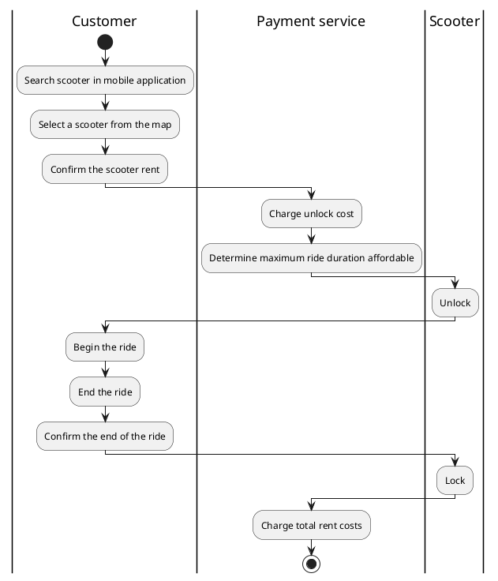

# User stories
Some user stories are taken from end users and some other are taken from the business representative, business employees.
##### 1a - Search of a scooter
>As a customer, I want to open the mobile application and search for free scooters in my area.
##### 1b - Choose and find a scooter
>As a customer, I want to be able to select a scooter near myself and make it ring in order to find it if it's hidden.
##### 1c - Rent a scooter
>As a customer, I want to confirm on my phone and start riding. When I'm done, I want to leave the scooter where I can and confirm the end of the trip on the app.
##### 2 - Battery level
>As a customer, when I'm searching a scooter, I want to know its battery level in advance.
##### 3a - Area of service policy
>When a scooter is taken out of the area of service borders, it locks.
##### 3b - Customer notification of the area border
>As a customer, when I'm approaching the area of service border, I want to be warned about the possibility that my scooter gets locked.

_How do you want to get warned?_
>I'd like the scooter to play a specific sound, while I get a notification on my phone.
##### 4 - Power save policy
>When the battery goes below a threshold, the scooter enters a power save mode, during which it runs slower than normal.
##### 5 - Customer notification of battery usage
>As a customer, I want to be warned when the battery is running low. I want to be warned with a ringtone.
##### 6 - Battery exhausted policy
>When the battery is running low, the scooter warns the customer, if present, that the run must end and enters a standby mode during which it's disabled.
##### 7 - Monitoring of scooters
>As the business manager, I want to be able to see the position and the battery level of every scooter in a map.
##### 8 - Insights from the system
>As the business manager, I want to get suggestions about strategic places for the drop points of the next day.
##### 9 - Unlock policy for employees.
>As a business employee I want to be able to unlock freely the scooters in order to move them.
##### 10 - Vandalism prevention 
>The scooter should discourage theft and vandalism by playing a message when moved while locked or disabled.
##### 11 - Integration with legacy payment system
>As the business manager, I want the customers to pay for rides through the existing system.

_Does the legacy system keep track of all customers data?_
>If I remember correctly, yes.

_From the legacy system documentation:_
The legacy payment system needs access to trip data and to customers rent/unlock requests.

# Story Diagrams
##### Story #1 Diagram

